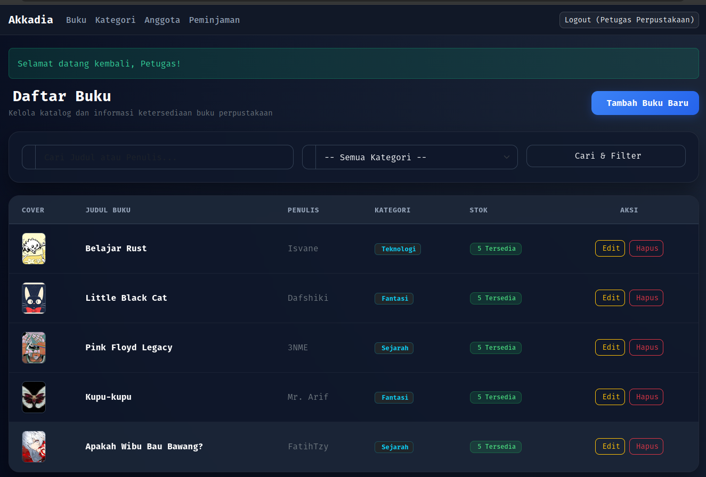

# Akkadia

This repository contains the project submission for Advanced Web - Final Semester Exam.  
Thank you, Pak ([@Amir](https://github.com/AMIRUDIN5592)) for teaching us 😄



### Members

* **Haiqal A.** ([@Haiqal](https://github.com/Isvane)) | **Project Lead & Fullstack Engineer**
* **Dafa A.** ([@Dafa](https://github.com/Dafa-Web-progaming)) | **Frontend Developer & Technical Writer**
* **Arif R.** ([@Arif](https://github.com/arifrahmanpratama1)) | **Manager & Logistics**
* **Adi N.** ([@Adi](https://github.com/3NME)) | **Presentation**
* **Fatih.** ([@Fatih](https://github.com/fatihterbaru)) | **Presentation**

_For better insight, please inspect the git commit history_

### Getting Started

```bash
# 1. Clone the repo
git clone https://github.com/my-phantasia/akkadia.git
cd akkadia

# 2. Copy environment file
cp .env.example .env

# 3. Install dependencies via Composer
# Local composer install:
composer install
# Using Docker:
docker run --rm -v $(pwd):/app -w /app composer install

# 4. Run the Docker container
just up
# Alternative:
docker compose up -d

# 5. Setup (Generate Key, Migration, & Seeder)
just artisan key:generate
just migrate
just artisan db:seed

# Alternatively you can execute commands through Docker:
docker compose exec app php artisan key:generate
docker compose exec app php artisan migrate
docker compose exec app php artisan db:seed

# Access the site
# If this port is already in use on your machine, simply open the docker-compose.yml file and change the first number in the port sections
http://localhost:8888/
```

## Common Commands

```
just up             # Start containers
just stop           # Stop containers
just destroy        # Tear down containers + volumes
just migrate        # Run migrations
just shell          # Open shell in PHP container
just artisan {args} # Run any Artisan command
```

---

## Git Workflow (Read This!)

To avoid merge conflicts and protect the main codebase, please follow this workflow below every time you work.

1. Switch to the main branch and pull the latest changes.
    ```bash
    git checkout main
    git pull origin main
    ```

2.  Create and switch to a new branch for your specific task (use a descriptive name like `feat/login-page` or `fix/button-bug`).
    ```bash
    git checkout -b your-branch-name
    ```

3.  Make your changes.

4. Once your changes are ready, stage them, commit them, and push your feature branch to the remote repository.
    ```bash
    git add .
    git commit -m "feat: description of changes"
    git push origin your-branch-name
    ```

5. Go to GitHub and open a **Pull Request (PR)** from `your-branch-name` into `main`.
